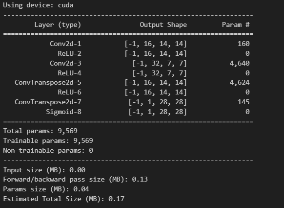
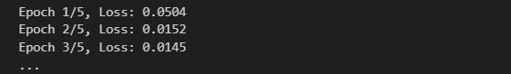
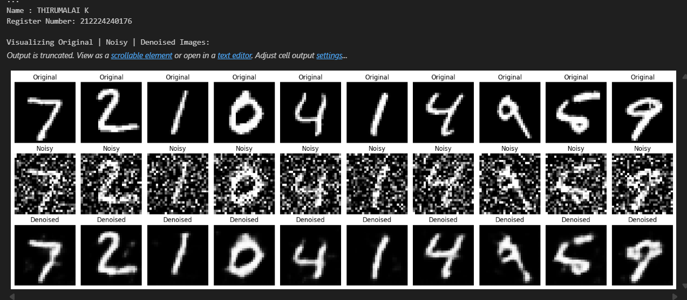

# DL- Convolutional Autoencoder for Image Denoising

## AIM
To develop a convolutional autoencoder for image denoising application.

## THEORY


## Neural Network Model
Include the neural network model diagram.

## DESIGN STEPS
### STEP 1: 
Load MNIST data and add noise to images.

### STEP 2: 
Build a convolutional autoencoder.

### STEP 3: 
Train the model with noisy images, minimizing MSE loss.

### STEP 4: 
Update weights using backpropagation.

### STEP 5: 
Test the model and visualize original, noisy, and denoised images.

### STEP 6: 
Repeat through multiple epochs for better denoising performance.


## PROGRAM

### Name: THIRUMALAI K

### Register Number: 212224240176

```python

# Denoising Autoencoder using PyTorch (Final Fixed Version for MNIST - 28x28)

import torch
import torch.nn as nn
import torch.optim as optim
from torch.utils.data import DataLoader
from torchvision import datasets, transforms
import matplotlib.pyplot as plt
import numpy as np
from torchsummary import summary

# Set device
device = torch.device("cuda" if torch.cuda.is_available() else "cpu")
print(f"Using device: {device}")

# Image transform
transform = transforms.Compose([
    transforms.ToTensor()
])

# Load MNIST dataset
train_dataset = datasets.MNIST(root='./data', train=True, download=True, transform=transform)
test_dataset = datasets.MNIST(root='./data', train=False, download=True, transform=transform)

train_loader = DataLoader(train_dataset, batch_size=128, shuffle=True)
test_loader = DataLoader(test_dataset, batch_size=128, shuffle=False)

# Add noise
def add_noise(inputs, noise_factor=0.5):
    noisy = inputs + noise_factor * torch.randn_like(inputs)
    return torch.clamp(noisy, 0., 1.)

# Autoencoder
class DenoisingAutoencoder(nn.Module):
    def __init__(self):
        super(DenoisingAutoencoder, self).__init__()
        self.encoder = nn.Sequential(
            nn.Conv2d(1, 16, 3, stride=2, padding=1),    # 28x28 -> 14x14
            nn.ReLU(True),
            nn.Conv2d(16, 32, 3, stride=2, padding=1),   # 14x14 -> 7x7
            nn.ReLU(True)
        )
        self.decoder = nn.Sequential(
            nn.ConvTranspose2d(32, 16, 3, stride=2, padding=1, output_padding=1),  # 7x7 -> 14x14
            nn.ReLU(True),
            nn.ConvTranspose2d(16, 1, 3, stride=2, padding=1, output_padding=1),   # 14x14 -> 28x28
            nn.Sigmoid()  # Output between 0 and 1
        )

    def forward(self, x):
        x = self.encoder(x)
        x = self.decoder(x)
        return x

# Initialize model
model = DenoisingAutoencoder().to(device)
criterion = nn.MSELoss()
optimizer = optim.Adam(model.parameters(), lr=0.001)

# Print summary
summary(model, input_size=(1, 28, 28))

# Train the autoencoder
def train(model, loader, criterion, optimizer, epochs=5):
    model.train()
    for epoch in range(epochs):
        running_loss = 0.0
        for images, _ in loader:
            images = images.to(device)
            noisy_images = add_noise(images).to(device)

            outputs = model(noisy_images)
            loss = criterion(outputs, images)

            optimizer.zero_grad()
            loss.backward()
            optimizer.step()
            running_loss += loss.item()

        print(f"Epoch {epoch+1}/{epochs}, Loss: {running_loss/len(loader):.4f}")

# Visualize original, noisy, denoised
def visualize_denoising(model, loader, num_images=10):
    model.eval()
    with torch.no_grad():
        for images, _ in loader:
            images = images.to(device)
            noisy_images = add_noise(images).to(device)
            outputs = model(noisy_images)
            break  # First batch

    # Convert to numpy
    images = images.cpu().numpy()
    noisy_images = noisy_images.cpu().numpy()
    outputs = outputs.cpu().numpy()

    print("\nName : THIRUMALAI K")
    print("Register Number: 212224240176")
    print("\nVisualizing Original | Noisy | Denoised Images:")

    plt.figure(figsize=(18, 6))
    for i in range(num_images):
        # Original
        ax = plt.subplot(3, num_images, i + 1)
        plt.imshow(images[i].squeeze(), cmap="gray")
        ax.set_title("Original")
        plt.axis("off")

        # Noisy
        ax = plt.subplot(3, num_images, i + 1 + num_images)
        plt.imshow(noisy_images[i].squeeze(), cmap="gray")
        ax.set_title("Noisy")
        plt.axis("off")

        # Denoised
        ax = plt.subplot(3, num_images, i + 1 + 2 * num_images)
        plt.imshow(outputs[i].squeeze(), cmap="gray")
        ax.set_title("Denoised")
        plt.axis("off")

    plt.tight_layout()
    plt.show()

# Train and visualize
train(model, train_loader, criterion, optimizer, epochs=5)
visualize_denoising(model, test_loader)

```

### OUTPUT

### Model Summary


### Training loss


## Original vs Noisy Vs Reconstructed Image


## RESULT

Thus, a convolutional autoencoder for image denoising application has been developed.